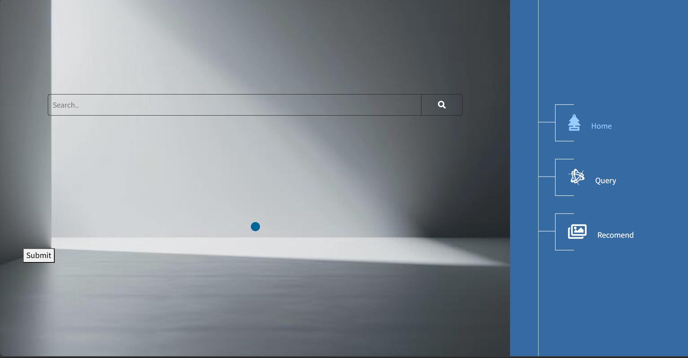
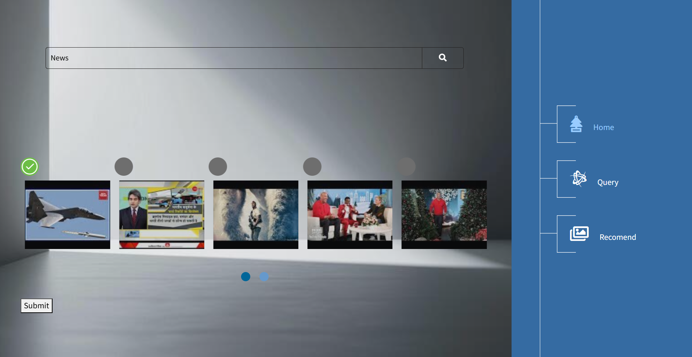
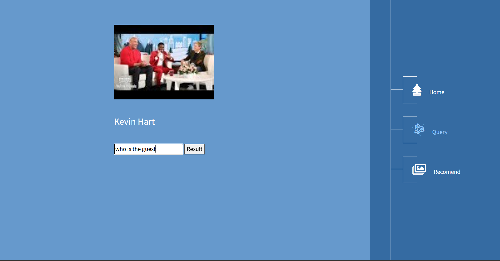
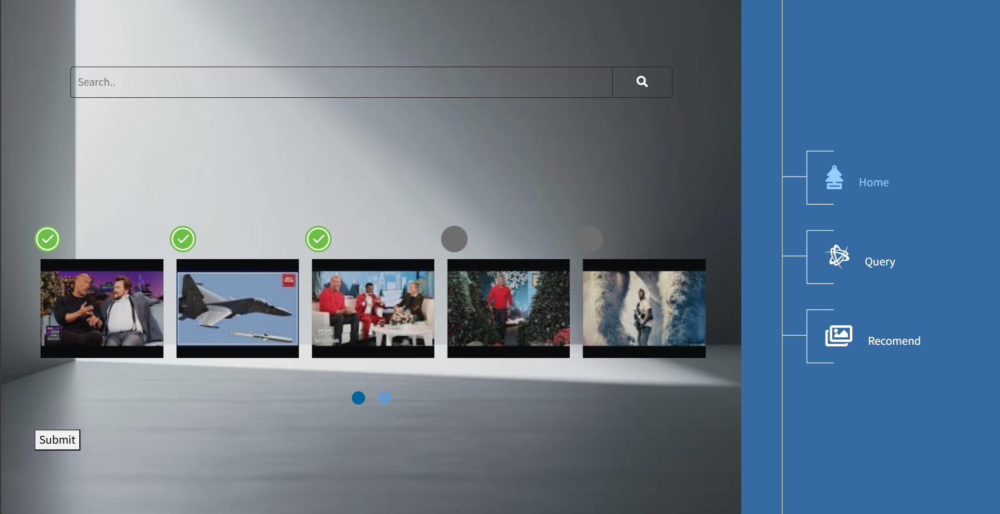
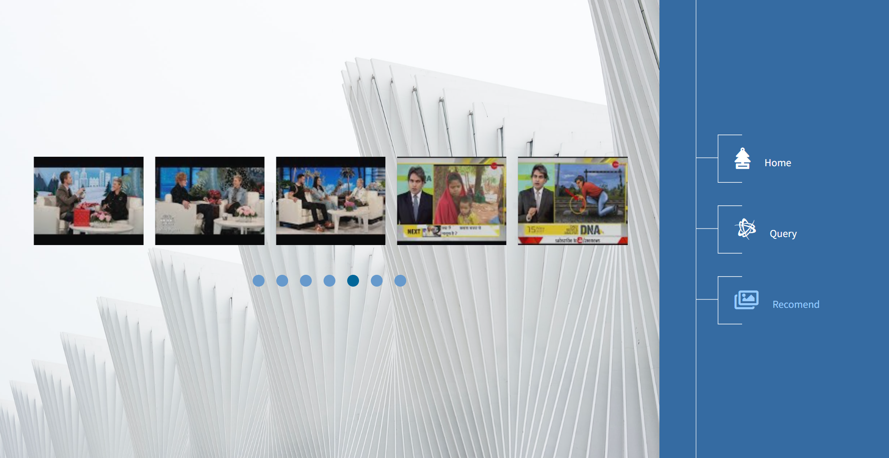

# VidSage

**VidSage** is a smart video recommendation platform designed to understand your commands or searches, providing tailored video recommendations based on your preferences. Whether you want to search for multiple videos or get answers about a specific video, VidSage is here to assist.

## Features

- **Smart Video Search**: Understands your spoken or typed commands to recommend relevant videos.
  
- **Query & Answer**: Allows you to ask questions about a specific video, providing detailed answers based on the content.

- **Multi-Video Recommendations**: Offers recommendations based on one or more selected videos, helping you discover more content you’ll love.

## How to Use

Here’s a step-by-step guide with images to help you navigate the app:

1. **Home Section**: 
    
   - The first image shows the app's home screen when you start VidSage.


2. **Search Results**:
    
   - The second image displays the response after performing a search. (*Note: You can perform up to 3 searches, after which the cache is cleared, and the results are reset.*)
   - You must select one video from the results to proceed to the "Query" section.

3. **Query Section**:
    
   - The third image shows an example of the "Query" section, where you can ask questions about the selected video and get detailed answers.

4. **Multiple Video Selection**:
    
   - The fourth image demonstrates selecting multiple videos in the "Home" section for recommendation purposes.

5. **Recommendation Results**:
    
   - The fifth image displays the recommendations provided in the "Recomend" section after selecting multiple videos.

## Getting Started

To set up VidSage on your local machine:

1. **Clone the Repository**:
   ```bash
   git clone https://github.com/your-username/VidSage.git
   cd VidSage
   ```

2. **Install Dependencies**:
   ```bash
   pip install -r requirements.txt
   ```

3. **Download the Dataset**:
   - Since the necessary files are not yet uploaded to S3, download the dataset from [this link](https://www.kaggle.com/datasets/ibrahimkaratas/youtubetrendvideos).

4. **Run the Project**:
   - To execute the project, run the following command:
   ```bash
   dvc repro
   ```

## Future Plans

VidSage is in active development, and more complexity and features will be added to the codebase in the future. Stay tuned for updates!

